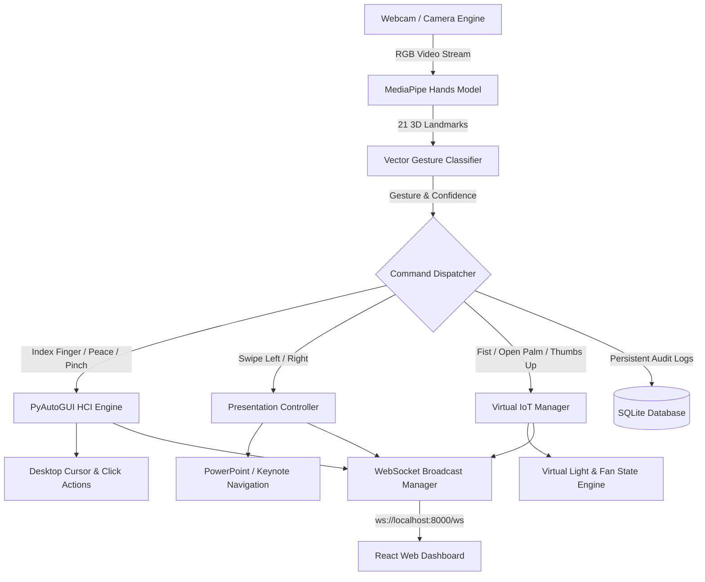

# AI-Powered Gesture-Based Smart Human–Computer Interaction & IoT Control System

[](https://github.com/YAGAVI2006/gesture/actions/workflows/ci.yml)
[](https://opensource.org/licenses/MIT)
[](https://www.python.org/downloads/)
[](https://react.dev/)

An enterprise-grade, full-stack Human-Computer Interaction (HCI) and Internet of Things (IoT) control system powered by Computer Vision and AI. The application leverages a standard webcam to detect 21 3D hand landmarks in real time using **MediaPipe**, classifies static and dynamic gestures, and translates them into system cursor movements, PowerPoint slide controls, and simulated smart IoT devices (**Smart Light** and **Smart Fan**).

---

## 🌟 System Architecture



---

## 🚀 Key Features

1. **AI Hand Gesture Engine**:
   - Real-time 21 3D hand landmark tracking using MediaPipe & OpenCV.
   - Dynamic gesture recognition algorithm evaluating vector angles and spatial distances.
   - Calculates FPS, confidence score %, and tracking status in real time.
2. **Gesture-Based HCI Computer Control**:
   - **Index Finger Pointing** → Move mouse cursor smoothly (with exponential moving average interpolation).
   - **Peace Gesture** → Mouse left click.
   - **Pinch Gesture** → Mouse double click / select.
   - Configurable safety cooldown (default 1.2s) to eliminate accidental double-triggers.
3. **PowerPoint Presentation Control**:
   - **Swipe Right** → Next slide.
   - **Swipe Left** → Previous slide.
   - Presentation start (`F5`) and exit (`Esc`) triggers.
4. **Virtual IoT Control & Abstraction Layer**:
   - Simulated **Smart Light** (brightness, state, glowing UI animation).
   - Simulated **Smart Fan** (speed level, state, spinning UI animation).
   - Clean `BaseIoTDevice` abstraction layer ready for MQTT / physical ESP32 microcontrollers.
5. **Optional Speech Recognition**:
   - Background voice command listener ("turn on light", "turn off fan", "presentation mode").
   - Non-blocking execution with automatic fallback if no microphone is connected.
6. **Real-Time Web Dashboard (React + Tailwind CSS + Recharts)**:
   - High-contrast dark mode glassmorphism UI.
   - Live MJPEG video stream canvas.
   - Real-time WebSocket synchronization (`ws://localhost:8000/ws`).
   - Filterable activity log stream with live text search & CSV export.
   - Recharts visual graphs for gesture breakdown and trigger sources.
   - Manual override toolbar, hotkeys (`L`, `F`, `P`), and settings modal.

---

## 🖐️ Gesture-to-Command Mapping Reference

| Gesture | Visual | Action Triggered | Target Subsystem |
| :--- | :---: | :--- | :--- |
| **Index Finger** | 👆 | Smooth Mouse Cursor Movement | Computer HCI |
| **Peace / Two Fingers** | ✌️ | Mouse Left Click | Computer HCI |
| **Pinch** | 🤏 | Mouse Double Click / Select | Computer HCI |
| **Fist** | ✊ | Turn Smart Light **ON** | Virtual IoT |
| **Open Palm** | ✋ | Turn Smart Fan **OFF** | Virtual IoT |
| **Thumbs Up** | 👍 | Turn Smart Light **OFF** | Virtual IoT |
| **Swipe Right** | 👉 | Next Slide | Presentation Mode |
| **Swipe Left** | 👈 | Previous Slide | Presentation Mode |

---

## 🛠️ Technology Stack

- **Backend**: Python 3.9+, FastAPI, MediaPipe, OpenCV, NumPy, PyAutoGUI, SpeechRecognition, SQLAlchemy, SQLite, Uvicorn, WebSockets.
- **Frontend**: React 19, Vite, Tailwind CSS, Lucide React Icons, Recharts, Axios, WebSockets.

---

## 📦 Installation & Setup Guide

### 1. Local Setup
```bash
# Backend Setup
cd backend
pip install -r requirements.txt
python -m uvicorn app.main:app --host 0.0.0.0 --port 8000 --reload

# Frontend Setup (in a new terminal)
cd frontend
npm install
npm run dev
```

### 2. Single-Command Docker Deployment
```bash
docker-compose up --build
```
> Access dashboard on `http://localhost:80` and backend API on `http://localhost:8000`.

### 3. Automated Testing
```bash
cd backend
pytest
```

---

## 📚 Documentation & Integration

Detailed technical documentation is available in the `docs/` folder:
- [Visual Gesture Guide](file:///c:/Users/HP/Desktop/gesture/docs/gesture_guide.md)
- [Architecture Overview](file:///c:/Users/HP/Desktop/gesture/docs/architecture.md)
- [API & WebSocket Specification](file:///c:/Users/HP/Desktop/gesture/docs/api.md)
- [Project Flow & Data Pipeline](file:///c:/Users/HP/Desktop/gesture/docs/project-flow.md)
- [Physical ESP32 & MQTT Setup Guide](file:///c:/Users/HP/Desktop/gesture/docs/esp32_mqtt_guide.md)

---

## 📄 License
Released under the [MIT License](LICENSE).
