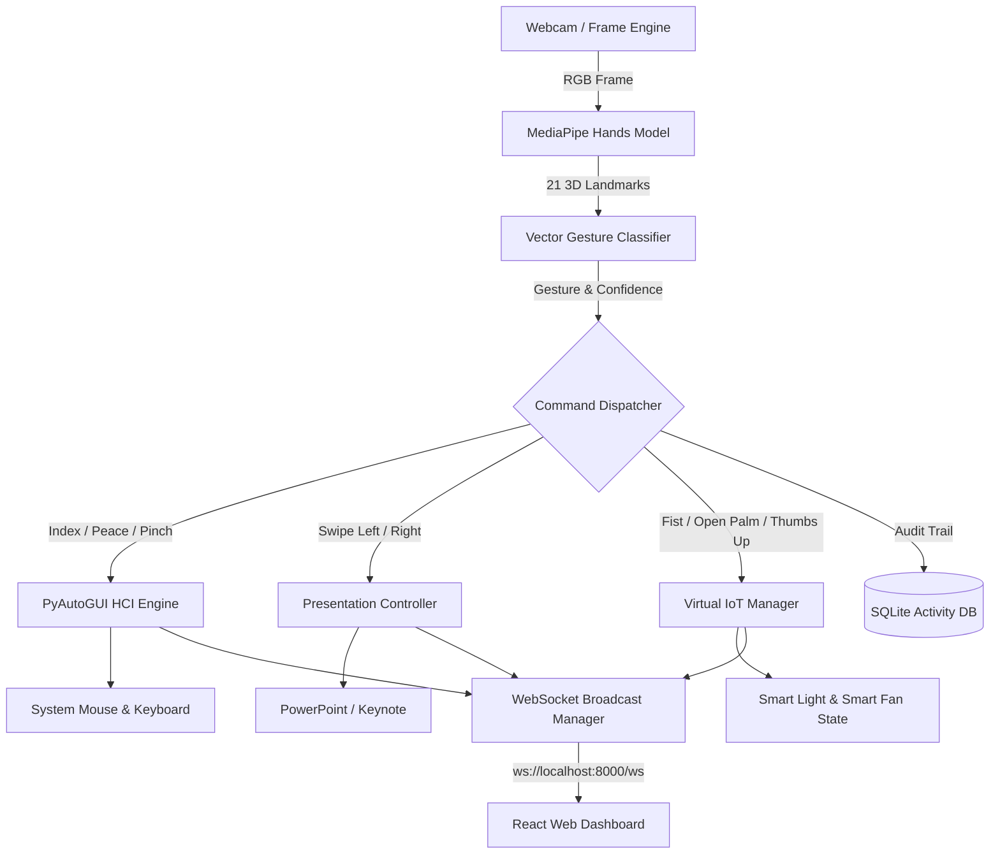

# System Architecture Documentation

## AI-Powered Gesture-Based Smart Human–Computer Interaction & IoT Control System

---

## 1. Executive Summary

This project implements a full-stack, real-time Computer Vision and Human-Computer Interaction (HCI) framework. The system processes live camera feeds to detect 21 3D hand landmarks via MediaPipe, classifies 8 distinct static and dynamic gestures, and translates them into system-level computer control actions, PowerPoint slide navigation, and Virtual IoT device commands.

---

## 2. Core Subsystems

### 2.1 AI Vision & Gesture Engine (`app/gesture`)
- **MediaPipe Hands**: Tracks 21 3D hand landmarks per frame at ~30 FPS.
- **Gesture Classifier**: Uses Euclidean distances and geometric vector angles between landmark nodes (Thumb, Index, Middle, Ring, Pinky tips vs MCP/PIP joints) to identify:
  - `Open Palm` (Fan OFF)
  - `Fist` (Light ON)
  - `Thumbs Up` (Light OFF)
  - `Peace` (Left Mouse Click)
  - `Index Finger Pointing` (Smooth Mouse Movement)
  - `Pinch` (Select / Double Click)
  - `Swipe Left` / `Swipe Right` (Dynamic frame history tracking X-coordinate delta over time).
- **Safety & Cooldown**: Implements a configurable lockout timer (default 1.5s) to eliminate repeated or accidental triggers.

### 2.2 Computer Interaction & Presentation Layer (`app/computer_control`, `app/presentation`)
- **Cursor Smoothing**: Applies exponential moving average (linear interpolation) between previous and target cursor coordinates to eliminate hand jitter.
- **Failsafe**: Configured with PyAutoGUI fail-safe screen bounds.
- **Presentation Control**: Translates dynamic swipe gestures into keyboard events (`Right Arrow`, `Left Arrow`, `F5`, `Esc`).

### 2.3 Virtual IoT Abstraction Layer (`app/iot`)
- Abstract base class `BaseIoTDevice` defines standard interfaces (`turn_on()`, `turn_off()`, `get_status()`).
- `VirtualSmartLight` and `VirtualSmartFan` maintain state, command history, and last updated timestamps in memory.
- Design allows seamless swapping to an MQTT client for physical ESP32 microcontrollers without modifying gesture logic.

### 2.4 Real-Time Web Dashboard (`frontend/src`)
- Developed in Vite + React 19 + Tailwind CSS + Lucide Icons + Recharts.
- Real-time streaming via WebSocket (`/ws`) and MJPEG live vision feed (`/api/video_feed`).
- Displays interactive animated state indicators (glowing light bulb, spinning fan blades) and filterable activity logs.
